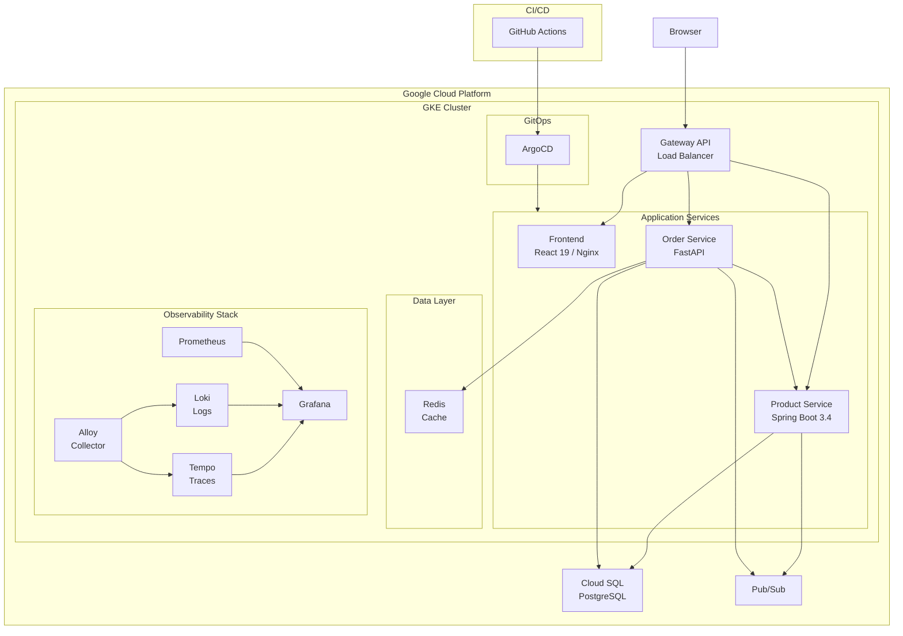

# CloudMart

A production-grade microservices e-commerce platform on GKE, showcasing DevOps best practices from infrastructure-as-code to observability.


## Architecture



## Tech Stack

| Technology | Purpose |
|---|---|
| Java 21 / Spring Boot 3.4 | Product Service REST API |
| Python 3.12 / FastAPI | Order Service REST API |
| React 19 / TypeScript / Tailwind | Frontend SPA |
| PostgreSQL (Cloud SQL) | Relational database (private IP) |
| Redis | Cache-aside for order service |
| Google Pub/Sub | Async event messaging between services |
| GKE (Google Kubernetes Engine) | Container orchestration |
| OpenTofu | Infrastructure as code |
| Kustomize | Kubernetes manifest management (base + overlays) |
| ArgoCD | GitOps continuous deployment |
| GitHub Actions | CI/CD pipelines (build, test, scan, deploy) |
| Prometheus | Metrics collection and alerting |
| Grafana | Dashboards and visualization |
| Loki | Log aggregation |
| Tempo | Distributed tracing |
| Alloy | OpenTelemetry collector |

## Project Structure

```
cloudmart/
├── services/
│   ├── product-service/     # Java/Spring Boot REST API
│   ├── order-service/       # Python/FastAPI REST API
│   └── frontend/            # React SPA + Nginx
├── infrastructure/
│   ├── terraform/           # OpenTofu modules + environments
│   │   ├── modules/         # networking, gke, database, registry, pubsub, iam, bastion, wif
│   │   └── environments/    # dev, staging, prod
│   └── ansible/             # Bastion setup playbooks
│       └── roles/           # common, k8s-tools
├── k8s/
│   ├── base/                # Kustomize base manifests
│   │   ├── product-service/ # Deployment, Service, ConfigMap
│   │   ├── order-service/   # Deployment, Service, ConfigMap
│   │   ├── frontend/        # Deployment, Service, ConfigMap
│   │   ├── redis/           # Redis deployment
│   │   ├── network-policies/# Default-deny + allow-list policies
│   │   ├── rbac/            # Namespace admin/viewer roles
│   │   └── secrets/         # Secret templates
│   ├── overlays/            # Environment overlays (dev/staging/prod)
│   └── platform/            # Monitoring, ArgoCD, Gateway configs
├── .github/workflows/       # CI/CD pipelines
│   ├── ci-product-service.yml
│   ├── ci-order-service.yml
│   ├── ci-frontend.yml
│   ├── ci-terraform.yml
│   ├── promote-staging.yml
│   ├── promote-prod.yml
│   └── _build-and-deploy.yml
├── docker-compose.yml       # Local development
├── Makefile                 # Common build/deploy targets
└── .env.example             # Required environment variables
```

## Prerequisites

| Tool | Version | Purpose |
|---|---|---|
| gcloud CLI | latest | GCP authentication and project management |
| OpenTofu | >= 1.11 | Infrastructure provisioning |
| kubectl | >= 1.31 | Kubernetes cluster management |
| Helm | >= 3.17 | Kubernetes package management |
| Docker | latest | Container builds and local development |
| Node.js | 20+ | Frontend build tooling |
| pnpm | latest | Frontend package manager |
| Java | 21 | Product Service development |
| Python | 3.12+ | Order Service development |
| uv | latest | Python package and project manager |

## Quick Start (Local Development)

1. Clone the repository:

```bash
git clone https://github.com/Moscuuu/cloudmart.git
cd cloudmart
```

2. Copy and configure environment variables:

```bash
cp .env.example .env
# Edit .env with your values
```

3. Start services locally:

```bash
make dev-up
```

4. Run all tests:

```bash
make test-all
```

5. Stop services:

```bash
make dev-down
```

## GCP Deployment

> **Full deployment runbook:** See [docs/DEPLOYMENT.md](docs/DEPLOYMENT.md) for the complete, battle-tested guide covering infrastructure, platform stack, database seeding, OAuth, monitoring, and troubleshooting — with every gotcha documented.

The sections below provide a quick overview. For step-by-step instructions with copy-pasteable commands, use the deployment guide.

### 1. Create GCP Project and Enable APIs

```bash
gcloud projects create YOUR_PROJECT_ID
gcloud config set project YOUR_PROJECT_ID

gcloud services enable \
  container.googleapis.com \
  sqladmin.googleapis.com \
  artifactregistry.googleapis.com \
  pubsub.googleapis.com \
  compute.googleapis.com \
  servicenetworking.googleapis.com \
  iam.googleapis.com \
  iap.googleapis.com
```

### 2. Provision Infrastructure

```bash
cd infrastructure/terraform/environments/dev
tofu init
tofu plan -out=plan.tfplan
tofu apply plan.tfplan
```

See [infrastructure/README.md](infrastructure/README.md) for detailed Terraform module documentation.

### 3. Build and Push Container Images

```bash
# Authenticate with Artifact Registry
gcloud auth configure-docker us-east1-docker.pkg.dev

# Build and push each service
make build-all
# Tag and push to Artifact Registry
```

### 4. Deploy via ArgoCD

ArgoCD is configured with an app-of-apps pattern. After infrastructure is provisioned:

```bash
# Connect to GKE cluster
gcloud container clusters get-credentials cloudmart-dev --zone us-east1-b

# Access ArgoCD UI
kubectl port-forward svc/argocd-server -n argocd 8080:443

# ArgoCD will auto-sync the dev environment from the k8s/overlays/dev manifests
```

### 5. Access the Application

Once deployed, the application is accessible through the GKE Gateway load balancer. Retrieve the external IP:

```bash
kubectl get gateway -n gateway
```

## Demo Guide (Interview Walkthrough)

This section provides a step-by-step walkthrough for demonstrating the platform during interviews or portfolio reviews.

### 1. Architecture Overview

Start by presenting the Mermaid architecture diagram above. Highlight the microservices pattern, the separation of concerns between services, and the full observability stack.

### 2. Frontend and Product Browsing

Open the frontend in a browser. Browse the product catalog, demonstrating the responsive UI built with React 19, Tailwind CSS, and shadcn/ui. Products are served from the Product Service backed by Cloud SQL.

### 3. Place an Order (Cross-Service Flow)

Walk through the order placement flow:
- The Order Service validates stock availability by calling the Product Service
- On success, the order is persisted and a Pub/Sub event is published
- The Product Service subscribes to the event and decrements inventory
- Redis caches product availability for subsequent requests

### 4. Grafana Dashboards (RED Metrics)

Open Grafana and navigate to the service dashboards:
- **Request rate** -- incoming HTTP requests per second
- **Error rate** -- 4xx/5xx responses by endpoint
- **Duration** -- p50/p95/p99 latency distributions
- **Business metrics** -- orders placed, products created

### 5. Distributed Tracing (Tempo)

Open a trace in Grafana/Tempo showing a request flowing through:
- Frontend -> Gateway -> Order Service -> Product Service -> Cloud SQL
- Trace context propagation via OpenTelemetry
- Each span shows timing and metadata

### 6. Structured Logging (Loki)

Query logs in Grafana/Loki:
- JSON-formatted log entries with trace ID correlation
- Filter by service, severity, or trace ID
- Click from a log entry directly to its corresponding trace

### 7. Alerting (PrometheusRules)

Explain the alerting configuration:
- High error rate alerts (> 5% for 5 minutes)
- High latency alerts (p95 > 2 seconds)
- Service down alerts (zero instances for 2 minutes)
- Alerts route to Slack via Alertmanager with severity-based grouping

### 8. CI/CD Pipeline (GitHub Actions)

Show the CI/CD pipeline:
- **Build stage** -- compile, test, lint
- **Scan stage** -- Trivy container image scanning
- **Deploy stage** -- push to Artifact Registry, update Kustomize overlay, commit
- **Promotion** -- staging and production promotion workflows

### 9. GitOps (ArgoCD)

Show ArgoCD sync status:
- App-of-apps pattern for multi-environment management
- Dev environment auto-syncs with prune and self-heal
- Staging and production require manual sync approval

### 10. Security Posture

Walk through the security layers:
- **NetworkPolicies** -- default-deny with explicit allow-list per service
- **RBAC** -- namespace-scoped admin and viewer roles
- **Workload Identity** -- pod-to-GCP authentication without service account keys
- **Secrets management** -- Kubernetes Secrets with stringData templates

### 11. Infrastructure as Code

Walk through the Terraform modules:
- Modular design: networking, gke, database, registry, pubsub, iam, bastion, wif
- Environment isolation via separate state backends and tfvars
- VPC with private subnets, Cloud NAT, and VPC peering for Cloud SQL

## CI/CD Overview

The CI/CD pipeline automates the full path from code push to GKE deployment:

```
Push to main → CI builds + tests → Docker image pushed to Artifact Registry
  → Kustomize overlay updated with new image tag → ArgoCD syncs to GKE
```

| Workflow | Trigger | Purpose |
|---|---|---|
| `ci-product-service.yml` | Push to `services/product-service/**` | Build, test, scan, deploy Product Service |
| `ci-order-service.yml` | Push to `services/order-service/**` | Build, test, scan, deploy Order Service |
| `ci-frontend.yml` | Push to `services/frontend/**` | Build, test, scan, deploy Frontend |
| `ci-terraform.yml` | Push to `infrastructure/terraform/**` | Plan on PR, apply on merge |
| `promote-staging.yml` | Manual dispatch | Promote dev images to staging overlay |
| `promote-prod.yml` | Manual dispatch | Promote staging images to production overlay |
| `_build-and-deploy.yml` | Reusable workflow | Shared build, scan, and deploy logic |

**How it works:** Each service CI workflow calls `_build-and-deploy.yml` which builds the Docker image, scans it with Trivy, pushes to Artifact Registry (`us-east1-docker.pkg.dev`), then updates the Kustomize overlay with the new image tag and commits the change. ArgoCD detects the overlay change and syncs the new image to GKE automatically (dev auto-syncs; staging/prod require manual approval).

Authentication to GCP uses Workload Identity Federation — no long-lived service account keys. See [docs/DEPLOYMENT.md](docs/DEPLOYMENT.md) for the full platform deployment walkthrough.

## Security

CloudMart implements defense-in-depth security:

- **Network Policies** -- default-deny ingress/egress with per-service allow-list rules. See [k8s/base/network-policies/](k8s/base/network-policies/).
- **RBAC** -- namespace-scoped roles for admin and read-only access. See [k8s/base/rbac/](k8s/base/rbac/).
- **Workload Identity** -- pods authenticate to GCP APIs (Pub/Sub, Cloud SQL) via Kubernetes service account annotations, eliminating static credentials.
- **Secrets Management** -- sensitive values stored as Kubernetes Secrets with stringData templates. Never committed to version control.
- **Container Scanning** -- Trivy scans container images in CI before deployment.
- **Workload Identity Federation** -- CI/CD pipelines authenticate to GCP without service account keys.

See [k8s/README.md](k8s/README.md) for detailed security documentation.

## License

This project is licensed under the MIT License. See [LICENSE](LICENSE) for details.
